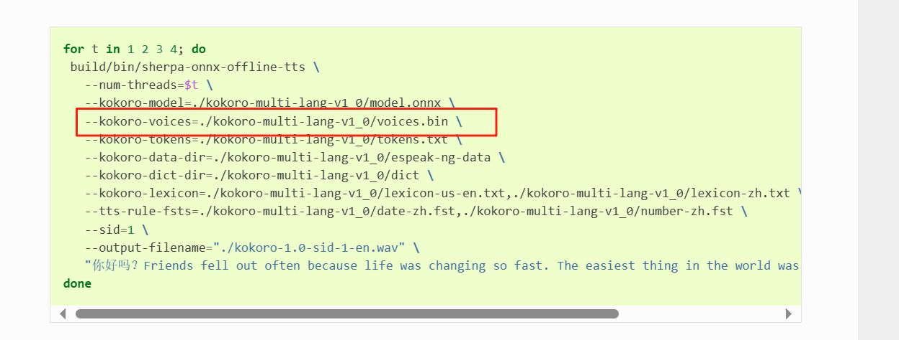
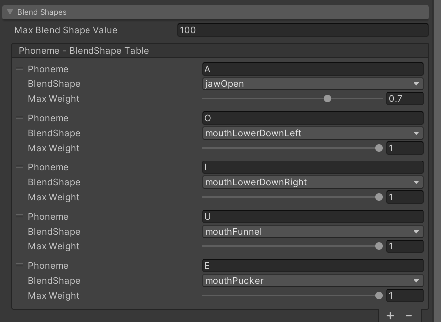
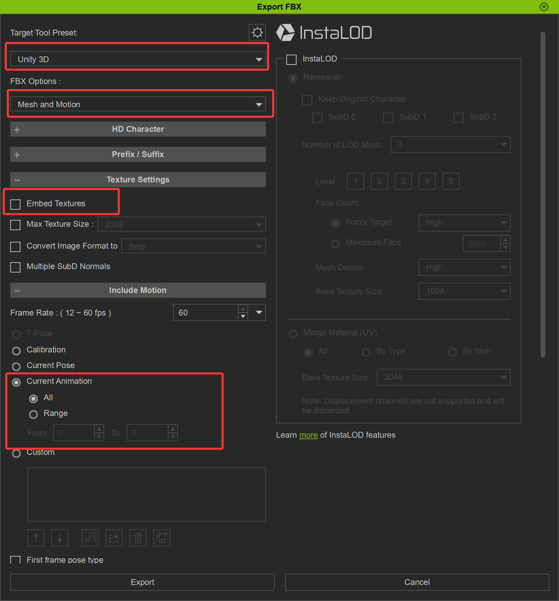
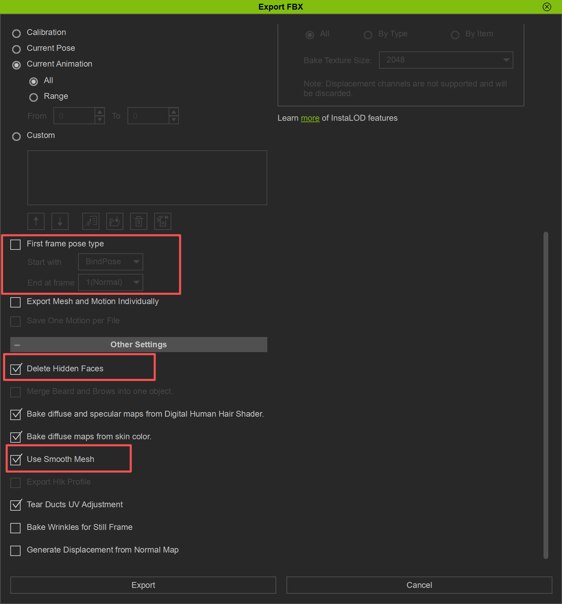
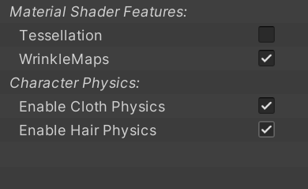
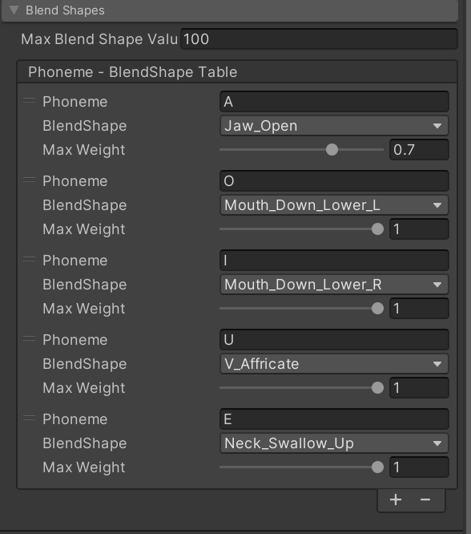

# 虚拟数字人


## 一、基础框架

### (一)Sherpa-Onnx

https://github.com/k2-fsa/sherpa-onnx


#### 1.Sherpa-Onnx官方Unity案例

[xue-fei/sherpa-onnx-unity: sherpa-onnx in unity](https://github.com/xue-fei/sherpa-onnx-unity)


#### 	2.ASR

​	[Release asr-models · k2-fsa/sherpa-onnx](https://github.com/k2-fsa/sherpa-onnx/releases/tag/asr-models)

#### 	3.TTS

[	Release tts-models · k2-fsa/sherpa-onnx](https://github.com/k2-fsa/sherpa-onnx/releases/tag/tts-models)


##### 		3.1 在线tts测试

​	https://huggingface.co/spaces/k2-fsa/text-to-speech


##### 		3.2 tts测试工具

​	[usherpa-onnx-tts: Unity使用sherpa-onnx实现离线语音合成](https://gitee.com/awnuxcvbn/usherpa-onnx-tts)


​	推荐TTS：

​	1.萝莉音: vits-zh-hf-theresa   ID:799

​	2.御姐音: sherpa-onnx-vits-zh-ll  ID:0

​	3.大叔音: kokoro-multi-lang-v1_1  ID:102

​	4.男青年: sherpa-onnx-vits-zh-ll  ID:4


###### 					3.2.1测试工具tts文档

​		[Kokoro — sherpa 1.3 documentation](https://k2-fsa.github.io/sherpa/onnx/tts/pretrained_models/kokoro.html#kokoro-multi-lang-v1-0-chinese-english-53-speakers)



 

###### 			3.2.2 kokoro-multi-lang

```c#
config.Model.Kokoro.Model = "kokoro-multi-lang-v1_0/model.onnx";
config.Model.Kokoro.Voices ="kokoro-multi-lang-v1_0/voices.bin";

config.Model.Kokoro.Lexicon = Application.streamingAssetsPath + "/kokoro-multi-lang-v1_0/lexicon-gb-en.txt" + ","
+ Application.streamingAssetsPath + "/kokoro-multi-lang-v1_0/lexicon-us-en.txt" + ","
+ Application.streamingAssetsPath + "/kokoro-multi-lang-v1_0/lexicon-zh.txt";

config.Model.Kokoro.Tokens = "kokoro-multi-lang-v1_0/tokens.txt";
config.Model.Kokoro.DataDir = "kokoro-multi-lang-v1_0/espeak-ng-data";
config.Model.Kokoro.DictDir = "kokoro-multi-lang-v1_0/dict";
config.Model.Kokoro.RuleFsts = Application.streamingAssetsPath + "/kokoro-multi-lang-v1_0/phone-zh.fst" + ","
+ Application.streamingAssetsPath + "/kokoro-multi-lang-v1_0/date-zh.fst" + ","
+ Application.streamingAssetsPath + "/kokoro-multi-lang-v1_0/number-zh.fst";
```


##### 	3.3 nuget更新dll

​	VisualStudio随便打开一个脚本,点击上菜单栏项目(P)下的管理Nuget程序包,搜索org.k2fsa.sherpa.onnx.runtime

​        默认安装目录 C:\Users\用户名\.nuget\packages


## 二、人工智能大模型

### (一)硅基流动

https://cloud.siliconflow.cn/i/psmQ8Adt


## 三、人物模型

### (一)Unity Package包(首选)


#### 1.数字人资源包

链接: https://pan.baidu.com/s/1nwPPjaj8Du0FybkuxaSsvg 提取码: 3uhw 


#### 2.BuildIn-转URP

(1)找到PackageManager下载Universal RP资源包

(2)Windows —》 Rendering —》Render Pipeline Converter

(3)卡渲材质丢失解决方案: 输入 com.unity.toonshader(Unity官方卡渲染材质，支持多种管线自动切换)

卡渲简单教程推荐:[Unity卡通渲染教程【从零实现高质量卡通渲染】 —— UnityToon Shader食用指南【MMD效果提升】_哔哩哔哩_bilibili](https://www.bilibili.com/video/BV19hkQB3Ezw/?spm_id_from=333.1007.top_right_bar_window_history.content.click&vd_source=cae5be50cf165d6b7a9ca9bf393cb773)


#### 	3.口型设置




​	A 	       jawOpen
​	E		mouthPucker
​	I		 mouthLowerDownRight
​	O	       mouthLowerDownLeft
​	U	       mouthFunnel


### (二)Character Creator 5(照片生成模型，自定义数字人)


#### 1.CC5安装教程

[CC5.02&Iclone8.62最新版安装教程以及安装包分享_哔哩哔哩_bilibili](https://www.bilibili.com/video/BV1HHn4z1EL2/?spm_id_from=333.1387.favlist.content.click&vd_source=cae5be50cf165d6b7a9ca9bf393cb773)

注意:新版本的Headshot_200_Plugin_for_CC5安装后需断网进入


#### 2.CC5 To Unity

[Charaecter Creater制作数字人和导出到unity_哔哩哔哩_bilibili](https://www.bilibili.com/video/BV1qRqBYgEdx/?spm_id_from=333.1387.favlist.content.click&vd_source=cae5be50cf165d6b7a9ca9bf393cb773)

[人工智能连接虚拟数字人、 Unity 教程（convai）_哔哩哔哩_bilibili](https://www.bilibili.com/video/BV17eQzYyEVz/?spm_id_from=333.1387.favlist.content.click&vd_source=cae5be50cf165d6b7a9ca9bf393cb773)


头发:Messy Curly


##### 	2.1 CC5导出设置






##### 	2.2 CC Unity Tool

[Installation — CC/iC Unity Tools 1.3.0 documentation](https://soupday.github.io/cc_unity_tools/installation.html)





##### 	2.3 Jaw Open修复(重要)

[通过DataLink插件导出到Unity的CC角色，由blendshapes驱动的下颌动画无法正常工作。·第#4期 ·soupday/CCIC-Unity-Pipeline-Plugin](https://github.com/soupday/CCIC-Unity-Pipeline-Plugin/issues/4)


问题原因:在CC3/CC4/CC5角色中，下颌开口是通过下**颌骨旋转**控制的，而不是混合形状。没有复合混合形状（将下颌骨旋转烘焙成网格变形），标准的ARKit混合形状只变形了嘴唇区域，但实际上不会打开下颌。


解决方案:不是只改 BlendShape，还需要改CC_Base_JawRoot的 localEulerAngles.z。

1.把 Jaw_Open 通过映射写到模型上的实际 BlendShape

2.CC_Base_JawRoot 的 localEulerAngles.z 直接改掉


##### 2.4 CC5 To Unity 口型设置




### (三)AI生成3D模型

图生3D测评：[五款ai生成3D工具大比拼！！！AI能否取代传统3D工作？_哔哩哔哩_bilibili](https://www.bilibili.com/video/BV1dmQ3YcEsA/?spm_id_from=333.1387.favlist.content.click)


#### 1.在线生成网站

混元3D：https://3d.hunyuan.tencent.com/
Rodin：https://hyper3d.ai/
Tripo：https://www.tripo3d.ai/app/home
Trellis：https://trellis3d.github.io/
Meshy：https://www.meshy.ai/discover


#### 2.在线绑定网站

[Mixamo](https://www.mixamo.com/)


#### 3.背景图

如果是图片，分辨率为2048*1152